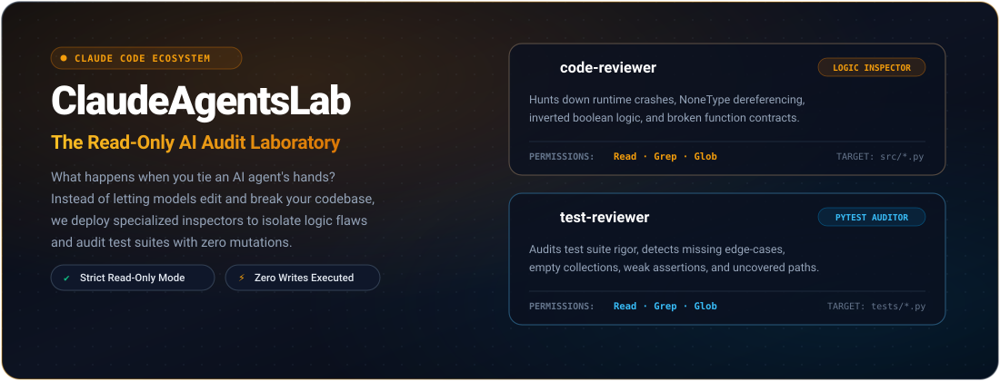

<div align="center">

  

  <br />

  <p align="center">
    <a href="#-the-over-eager-ai-problem">The Problem</a> &nbsp;•&nbsp;
    <a href="#-how-it-works-two-agents-zero-writes">How It Works</a> &nbsp;•&nbsp;
    <a href="#-forensic-cases-3-crimes-caught-by-the-agents">Forensic Cases</a> &nbsp;•&nbsp;
    <a href="#-architecture">Architecture</a> &nbsp;•&nbsp;
    <a href="#-quickstart">Quickstart</a>
  </p>

</div>

---

### 🛑 The "Over-Eager AI" Problem

You ask an AI model to fix a small edge-case in your project.  
It enthusiastically edits 14 unrelated files, rewrites core data structures, strips your comments, and introduces 3 new regressions you didn't have before.

**ClaudeAgentsLab was born from a fundamental experiment:**  
*What happens if you tie the AI's hands? What if you take away write permissions completely and turn it into an uncompromising, read-only code inspector?*

---

### 🛡️ How It Works: Two Agents, Zero Writes

Instead of trusting a single generalist model to write and test code simultaneously, **ClaudeAgentsLab** separates concerns into two specialized subagents operating inside a strict read-only sandbox (`Read`, `Grep`, `Glob`):

1. **`code-reviewer` (The Logic Detective):** Scans `src/*.py` to isolate runtime exceptions, inverted boolean logic, unhandled `None` returns, and dangerous mutation leaks.
2. **`test-reviewer` (The Quality Auditor):** Scans `tests/*.py` to verify whether the test suite actually exercises edge cases, empty collections, and error pathways.

> **The Golden Rule:** The agents cannot edit, cannot commit, and cannot mutate your code. They only produce crisp, actionable diagnostic reports.

---

### 🕵️‍♂️ Forensic Cases: 3 Crimes Caught by the Agents

To benchmark the subagents' real-world accuracy, `src/tasks.py` was seeded with three deliberate architectural flaws. Here is how the `code-reviewer` trapped each one:

#### 🔎 Case #01: The Inverted Filter
The function was returning completed tasks when asked for pending ones:
```diff
# File: src/tasks.py (Line 25)
- def get_pending_tasks(tasks):
-     return [task for task in tasks if task["completed"] is True]  # ❌ Inverted logic!
+ def get_pending_tasks(tasks):
+     return [task for task in tasks if not task.get("completed", False)]  # ✔ Trapped by agent
```

#### 🔎 Case #02: The NoneType Landmine
Searching for an ID that does not exist returns `None`, crashing downstream mutations with an unhandled `TypeError`:
```diff
# File: src/tasks.py (Line 18)
- def complete_task(tasks, task_id):
-     task = find_task(tasks, task_id)
-     task["completed"] = True  # ❌ Crashes if task_id does not exist!
+ def complete_task(tasks, task_id):
+     task = find_task(tasks, task_id)
+     if task is None:
+         raise ValueError(f"Task with id {task_id} not found")
+     task["completed"] = True
+     return task
```

#### 🔎 Case #03: The ID Clone Collision
Hardcoded IDs break identity integrity across all created tasks:
```diff
# File: src/tasks.py (Line 1)
- def create_task(title):
-     return {"id": 1, "title": title, "completed": False}  # ❌ Every task collides at ID 1
+ def create_task(tasks, title):
+     next_id = max([t["id"] for t in tasks], default=0) + 1  # ✔ Deterministic sequence
+     return {"id": next_id, "title": title, "completed": False}
```

<details>
<summary><b>🧪 Click to inspect the <code>test-reviewer</code> audit report on pytest</b></summary>

<br />

When evaluating `tests/test_tasks.py`, the `test-reviewer` flags:
* **Missing Error Paths:** `find_task()` has zero tests verifying behavior when querying a non-existent ID.
* **Empty Collection Invariants:** No tests validating functions against empty lists `[]`.
* **Mutation Isolation:** `test_complete_task()` fails to assert that other tasks in the list remain unaltered.

</details>

---

### ↳ Architecture

```text
ClaudeAgentsLab/
├── .claude/
│   ├── agents/
│   │   ├── code-reviewer.md        🤖 Subagent specification (Sonnet · Read-only)
│   │   └── test-reviewer.md        🧪 Subagent specification (Sonnet · Read-only)
│   └── skills/
│       ├── python-code-review/
│       │   └── SKILL.md            📜 Procedural manual for static logic auditing
│       └── python-test-review/
│           └── SKILL.md            📜 Procedural manual for pytest rigor verification
├── .agents/                        🔄 Google Antigravity compatibility mirror
├── src/                            📦 Application source code (testbench)
│   ├── tasks.py
│   └── validation.py
├── tests/                          🧪 Unit test suite
│   ├── test_tasks.py
│   └── test_validation.py
├── requirements.txt                ⚡ Project dependencies
├── README.md                       📑 Technical documentation
└── LICENSE                         ⚖️ MIT open source license
```

---

### ↳ Quickstart

```bash
# 1. Clone the repository
git clone https://github.com/josiasemm/ClaudeAgentsLab.git
cd ClaudeAgentsLab

# 2. Install dependencies
pip install -r requirements.txt

# 3. Run the unit test suite
pytest -v
```

---

### ↳ License

Distributed under the MIT License. See [LICENSE](LICENSE) for details.

<br />

<div align="center">
  
</div>