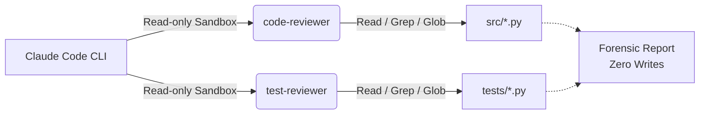

# ClaudeAgentsLab

**Specialized read-only Claude Code subagents for automated Python & Pytest QA.**

<kbd>Dual-pipeline inspection</kbd> &nbsp; <kbd>Zero writes</kbd> &nbsp; <kbd>Strict sandbox</kbd>

<br />

[Overview](#-overview) &nbsp;•&nbsp;
[Architecture](#-architecture--ecosystem) &nbsp;•&nbsp;
[Testbench](#-testbench--detected-defects) &nbsp;•&nbsp;
[Quickstart](#-quickstart)

---

> [!IMPORTANT]
> **Unrestricted AI agents in production introduce silent regressions.**  
> When a model is given blanket write access, it tends to over-edit, mask broken contracts, or hallucinate fixes. **ClaudeAgentsLab** demonstrates an enterprise-grade safety pattern: **Dual Read-Only Subagents** (`Read`, `Grep`, `Glob`) that rigorously isolate logical flaws and audit `pytest` suites without modifying a single file.

---

## ↳ Overview

**ClaudeAgentsLab** is a dual-pipeline auditing playground designed for the **Claude Code (Anthropic)** ecosystem. Instead of relying on a single generalist agent, it splits quality assurance into two specialized, sandboxed inspectors with strictly partitioned responsibilities:

| Subagent | Persona & Role | Execution Tools | Target Scope |
| :--- | :--- | :---: | :--- |
| **`code-reviewer`** | Senior Python Logic Inspector | `Read`, `Grep`, `Glob` | `src/*.py` · Runtime bugs, `TypeError` on `None`, inverted boolean operators, mutation side-effects. |
| **`test-reviewer`** | Pytest Rigor & Coverage Auditor | `Read`, `Grep`, `Glob` | `tests/*.py` · Uncovered edge-cases, weak assertions, missing error paths, testing idempotency. |

### 🛡️ Diagnostic Capabilities
- [x] **Logic Inversion**: Flags reversed conditionals (`is True` on pending tasks)
- [x] **Null Safety**: Detects missing `None` guards before key access (`TypeError`)
- [x] **Sequence Predictability**: Catches hardcoded identifier collisions across objects
- [x] **Collection Invariants**: Verifies suite rigor against boundary states like empty lists (`[]`)
- [x] **Missing Error Paths**: Audits negative test coverage for absent resource lookups

---

## ↳ Architecture & Ecosystem



```text
ClaudeAgentsLab/
├── .claude/
│   ├── agents/
│   │   ├── code-reviewer.md        🤖 Subagent specification (Sonnet · Read-only)
│   │   └── test-reviewer.md        🧪 Subagent specification (Sonnet · Read-only)
│   └── skills/
│       ├── python-code-review/
│       │   └── SKILL.md            📜 Procedural manual for static logic auditing
│       └── python-test-review/
│           └── SKILL.md            📜 Procedural manual for pytest rigor verification
├── .agents/                        🔄 Google Antigravity compatibility mirror
├── src/                            📦 Application source code (vulnerable testbench)
│   ├── tasks.py
│   └── validation.py
├── tests/                          🧪 Unit test suite (baseline coverage)
│   ├── test_tasks.py
│   └── test_validation.py
├── requirements.txt                ⚡ Dependencies (pytest)
├── README.md                       📑 Documentation
└── LICENSE                         ⚖️ MIT open source license
```

---

## ↳ Testbench & Detected Defects

The `src/tasks.py` module intentionally contains 3 critical architectural defects designed to benchmark the diagnostic precision of `code-reviewer`:

### 🔍 Defect 01: Inverted Boolean Logic
```diff
# File: src/tasks.py (Line 25)
- def get_pending_tasks(tasks):
-     return [task for task in tasks if task["completed"] is True]  # ❌ Returns completed tasks!
+ def get_pending_tasks(tasks):
+     return [task for task in tasks if not task.get("completed", False)]  # ✔ Clean logic
```

### 🔍 Defect 02: Potential `TypeError` on Missing Item
```diff
# File: src/tasks.py (Line 18)
- def complete_task(tasks, task_id):
-     task = find_task(tasks, task_id)
-     task["completed"] = True  # ❌ Crashes with TypeError if task_id does not exist (None)!
+ def complete_task(tasks, task_id):
+     task = find_task(tasks, task_id)
+     if task is None:
+         raise ValueError(f"Task {task_id} not found")
+     task["completed"] = True
+     return task
```

### 🔍 Defect 03: Static Identifier Collision
```diff
# File: src/tasks.py (Line 1)
- def create_task(title):
-     return {"id": 1, "title": title, "completed": False}  # ❌ Every task collides with ID 1
+ def create_task(tasks, title):
+     next_id = max([t["id"] for t in tasks], default=0) + 1  # ✔ Deterministic sequence
+     return {"id": next_id, "title": title, "completed": False}
```

<details>
<summary><b>📄 Click to view sample diagnostic report generated by <code>code-reviewer</code></b></summary>

<br />

```yaml
[DIAGNOSTIC REPORT: src/tasks.py]
Defect 01: Inverted Boolean Filter
  Location: src/tasks.py:25 in get_pending_tasks()
  Category: Logical Flaw (Severity: High)
  Diagnosis: Condition 'task["completed"] is True' filters completed tasks instead of pending ones.
  Recommended Fix: return [task for task in tasks if not task.get("completed", False)]

Defect 02: Unchecked NoneType Dereference
  Location: src/tasks.py:18 in complete_task()
  Category: Runtime Exception (Severity: Critical)
  Diagnosis: find_task() returns None if task_id is absent, causing unhandled TypeError on subscript access.
  Recommended Fix: Guard against None or raise ValueError(f"Task {task_id} not found")

Defect 03: Static Identifier Hardcoding
  Location: src/tasks.py:1 in create_task()
  Category: State / Collision (Severity: Medium)
  Diagnosis: Fixed id: 1 triggers primary key collision across sequential creations.
  Recommended Fix: Dynamically compute next identifier based on collection state.
```

</details>

<br />

<details>
<summary><b>🔎 Click to view how <code>test-reviewer</code> audits the test suite</b></summary>

<br />

The `test-reviewer` subagent inspects `tests/test_tasks.py` and flags:
* **Missing Error Paths:** `find_task()` has zero tests verifying what happens when querying a non-existent ID.
* **Empty Collection Invariants:** No tests validating functions against empty lists `[]`.
* **Weak Assertions:** `test_complete_task()` does not assert that other unrelated tasks remain untouched (mutation leak).

</details>

---

## ↳ Quickstart

### Prerequisites
* Python 3.10+
* Git

### Local Execution
```bash
# 1. Clone the repository
git clone https://github.com/josiasemm/ClaudeAgentsLab.git
cd ClaudeAgentsLab

# 2. Install dependencies
pip install -r requirements.txt

# 3. Execute unit test baseline
pytest -v
```

### ⚡ Running Audits in Claude Code

Launch Claude Code inside the repository:

```bash
claude
```

Invoke either subagent with clear natural language instructions:

```text
> Use the code-reviewer subagent to audit src/tasks.py for runtime defects.
```

```text
> Use the test-reviewer subagent to check tests/ for missing edge cases.
```

> [!TIP]
> Both subagents operate in strict read-only mode (`Read`, `Grep`, `Glob`). They provide diagnostic explanations and recommended diffs without altering any code.

---

## ↳ License

Distributed under the MIT License. See [LICENSE](LICENSE) for details.

<br />

<div align="center">
  
</div>